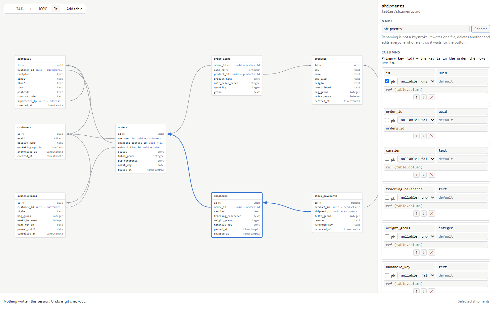

# dbmd

Your database model, in your repository, as markdown.

One markdown file per table. YAML frontmatter holds the columns, the indexes and
where the box sits on the canvas. Everything after the frontmatter is free
markdown, and that is where the reason a table looks the way it does gets
written down, which is the part no schema dump can recover. `dbmd studio` is a
local web view onto those files: drag a box, edit a column, type a paragraph,
and the markdown is rewritten underneath you. The diff is a normal diff and the
review is a normal pull request.

## One picture and one file, and they are the same thing



That is `dbmd studio` open on [`examples/shop`](examples/shop), a coffee
roastery's order book. `shipments` is selected, so the panel on the right is
editing `examples/shop/tables/shipments.md`, and that file is this:

```markdown
---
kind: table
table: shipments
columns:
  - name: id
    type: uuid
    pk: true
  - name: order_id
    type: uuid
    nullable: false
    ref: orders.id
  - name: carrier
    type: text
    nullable: false
  - name: tracking_reference
    type: text
    nullable: true
  - name: weight_grams
    type: integer
    nullable: true
  - name: handheld_key
    type: text
    nullable: false
  - name: packed_at
    type: timestamptz
    nullable: false
    default: now()
  - name: shipped_at
    type: timestamptz
    nullable: true
indexes:
  - name: shipments_order_idx
    columns: [order_id]
  - name: shipments_handheld_key
    columns: [handheld_key]
    unique: true
group: warehouse
layout: { x: 900, y: 640 }
---

One row per parcel. An order can have several: a 1kg bag goes on its own because
of the courier's weight bands, and an order that mixes a coffee we have with one
that is waiting for Thursday ships in two halves rather than making the customer
wait for both.

**`shipped_at` being null is the whole state machine.** A row exists from the
moment the parcel is packed, and `shipped_at` is stamped when the courier scans
it. Between those two, the parcel is in the depot: it is ours, it counts as
stock in the building, and `stock_movements` has not recorded anything for it
yet. Reading "has this shipped" as "does a shipments row exist" is the mistake
this table invites, and it has been made twice.
```

That is the frontmatter in full, and the first two paragraphs of a body that
keeps going. Every field in the panel is a line in the frontmatter, in the same
order. Scroll the panel and the indexes are there too, then a box holding the
body, which the studio carries byte for byte and never reflows.

The two halves of that file are why this exists. `unique: true` on
`shipments_handheld_key` is the difference between a parcel packed twice and a
parcel shipped twice, and the paragraph under the frontmatter is the only place
anybody will read that a `shipments` row is not a shipment. Introspection
recovers the first. Nothing recovers the second, so it lives in the same file
and goes through the same review.

## What a change looks like

Adding a column in the studio, by typing its name and its type into the panel
above and choosing `nullable: true`:

```diff
diff --git a/examples/shop/tables/shipments.md b/examples/shop/tables/shipments.md
--- a/examples/shop/tables/shipments.md
+++ b/examples/shop/tables/shipments.md
@@ -28,6 +28,9 @@ columns:
   - name: shipped_at
     type: timestamptz
     nullable: true
+  - name: signed_for_by
+    type: text
+    nullable: true
 indexes:
   - name: shipments_order_idx
     columns: [order_id]
```

No export step, no save button, and nothing else in the file moved. Commit it,
open a pull request, and the reviewer reads three added lines instead of a
picture they have to take on trust.

Dragging a box is the same idea from the other end. It rewrites the one
`layout:` line in that one table's file, so tidying a diagram touches only the
files whose boxes moved and never reads as a schema change.
[ADR 0003](docs/architecture/decisions/0003-markdown-on-disk-is-the-model.md)
argues the format from that requirement and three others.

## Running it

**`dbmd` is not published to npm.** `package.json` says `"private": true`, on
purpose, so `npx dbmd` resolves nothing today, for anybody. What works is a
checkout:

```bash
git clone https://github.com/BlakeHastings/dbmd.git
cd dbmd
npm ci
npm run build
```

After that, `node dist/cli.js` is the command written as `dbmd` everywhere
below, and it runs against a model directory anywhere. `npm run studio` is the
shortcut that builds and then opens this repository's own `examples/shop`, which
is the fastest way to get the picture above onto your own screen.
[`CONTRIBUTING.md`](CONTRIBUTING.md) takes that from a clean clone.

## The four commands

In the order you meet them. Every block below is real output, and all of it is
on stderr: **stdout is data and stderr is narration**, in every command, so
`dbmd check 2>/dev/null` is the quiet flag this CLI does not have.

**`dbmd init`** writes a model to start from, in a directory called `db-model`.

```
$ dbmd init
Created db-model, 4 files:
  _model.md
  notes/there-are-no-passwords-here.md
  tables/accounts.md
  tables/api_keys.md

Read _model.md first. It says what the rest of them are for.

The format is written down at https://github.com/BlakeHastings/dbmd/blob/main/docs/format.md
If this repository runs Prettier, add db-model/ to its .prettierignore.
Prettier rewrites the prose in these files, and the prose is the point.
```

**`dbmd studio [directory]`** serves that directory on loopback and opens it in
a browser. The URL it bound to is printed on stderr, and with the default port,
which is `0`, that line is the only way to learn the port. `--port N` picks one
yourself and `--no-open` binds without opening a browser. It listens on
127.0.0.1 only.

```
$ dbmd studio examples/shop --no-open
dbmd studio  http://127.0.0.1:53429/
  model      examples/shop
```

**`dbmd check [directory]`** is the one to put in CI. It reads the model, checks
every file against the format and the files against each other, and groups what
it finds by the file it is in.

```
$ dbmd check examples/shop
examples/shop: 8 tables, 2 notes, 1 group, no problems.
```

A `ref:` at a table nobody wrote is the thing this catches and a reviewer does
not, and the exit code is the answer a script reads:

```
$ dbmd check
tables/api_keys.md
    error  `ref: acccounts.id` on column `account_id` names no table; there is no tables/acccounts.md (ref-table-unknown)

db-model: 1 error across 1 file.
$ echo $?
1
```

`--strict` fails on a warning too, and `--json` puts the same report on stdout
with the same exit code:

```json
{
  "schema": 1,
  "ok": false,
  "directory": "db-model",
  "strict": false,
  "counts": { "errors": 1, "warnings": 0 },
  "diagnostics": [
    {
      "code": "ref-table-unknown",
      "severity": "error",
      "at": { "in": "file", "path": "tables/api_keys.md" },
      "message": "`ref: acccounts.id` on column `account_id` names no table; there is no tables/acccounts.md"
    }
  ]
}
```

**`dbmd export [directory]`** draws the model as a mermaid `erDiagram` and
writes it into the model directory's own `README.md`, between two markers,
leaving the rest of that file alone. GitHub renders it, so a pull request that
changes a table shows a changed picture to anybody who opens the directory.

```
$ dbmd export
Wrote db-model/README.md: 2 tables, 1 relationship.
$ dbmd export
db-model/README.md is already up to date: 2 tables, 1 relationship.
```

`--stdout` prints the document instead of writing it, which is what a CI job
wants. [`docs/ci.md`](docs/ci.md) is `check` and `export` as a GitHub Actions
workflow, with a reason for every line that is not obvious and a note on which
of its lines cannot run until there is a package to install.

## What it does not do

Two things, and both are decisions rather than gaps. Meeting them in review is
expensive, so they are here rather than three clicks away.

**It does not generate or apply DDL.** It describes a schema. A `default:` in a
model file is text the format carries and nothing ever executes it, and there is
no migration anywhere in this tool.

**It does not connect to a database.** Not to read one and not to write one. The
import path, which is not finished, reads a JSON file that a person produced by
running a query themselves, and the query is something `dbmd` hands you rather
than something it runs.

[ADR 0003](docs/architecture/decisions/0003-markdown-on-disk-is-the-model.md)
and [ADR 0007](docs/architecture/decisions/0007-engines-are-providers.md) are
the arguments, and
[`CONTRIBUTING.md`](CONTRIBUTING.md#before-you-write-anything) says what happens
to a pull request that adds either.

## Where to read more

- **[`docs/format.md`](docs/format.md) is the format.** Every key, every
  diagnostic, and the handful of things that are load-bearing and easy to guess
  wrong. It is written for somebody typing a model into a text editor with
  nothing installed, which is a thing you can do: a hand-written file and a
  studio-written file are the same file.
- **[`examples/shop`](examples/shop)** is a whole model in that format. Eight
  tables, one grouping box and two sticky notes, and it is the best answer to
  "what is the prose actually for". The test suite reads it on every run, so it
  cannot quietly go stale.
- **[`docs/ci.md`](docs/ci.md)** for running `check` and `export` on every pull
  request.
- **[`CONTRIBUTING.md`](CONTRIBUTING.md)** for working on `dbmd` itself, and
  **[`docs/architecture/decisions/`](docs/architecture/decisions/)** for what has
  been decided and why.

MIT licensed. Developed at
[`github.com/BlakeHastings/dbmd`](https://github.com/BlakeHastings/dbmd).
